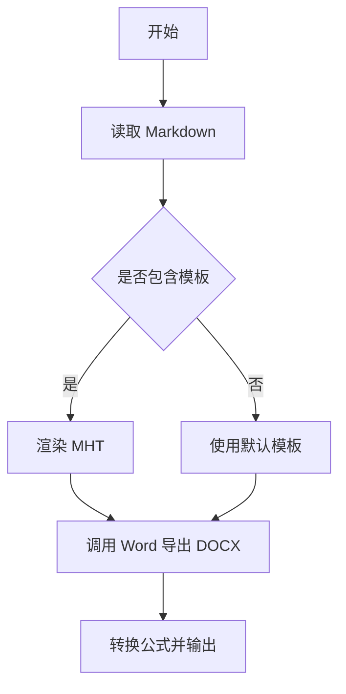

标题: md2word 示例文档
作者: cp-yu
版本: v1.0
日期: 2026-04-01
项目名称: md2word
摘要: 这是一个用于测试标题、列表、公式和 Mermaid 渲染效果的示例 Markdown。

# md2word 示例文档

这个示例文件用于验证 `md2word` 对常见 Markdown 结构的处理效果。

## 功能概览

- 支持标准标题层级
- 支持无序列表与有序列表
- 支持行内公式，例如 $a^2 + b^2 = c^2$
- 支持行间公式
- 支持 Mermaid 流程图代码块

## 导出检查项

1. 标题层级是否清晰
2. 列表缩进是否稳定
3. 公式是否在最终 Word 中正确转换
4. Mermaid 图是否被渲染为图片插入正文

## 公式示例

爱因斯坦质能方程的行内写法为 $E = mc^2$。

下面是一个行间公式：

$$
\int_0^1 x^2 \, dx = \frac{1}{3}
$$

下面再放一个常见矩阵示例：

$$
A =
\begin{bmatrix}
1 & 2 \\
3 & 4
\end{bmatrix}
$$

## Mermaid 示例

## 结论

如果这个文件能稳定导出为 `.docx` 和 `.wordmath.docx`，说明当前 skill 的基础链路是通的。
